# Barnes-Hut Algorithm Implementation Analysis

## 1. Algorithm Overview

The Barnes-Hut algorithm is a hierarchical approximation method that reduces the computational complexity of N-body simulations from O(N²) to O(N log N). The algorithm works by:

1. Dividing space into a quadtree (in 2D) or octree (in 3D)
2. Approximating distant groups of bodies as single bodies with combined mass
3. Using this approximation when calculating gravitational forces

### Algorithm Visualization

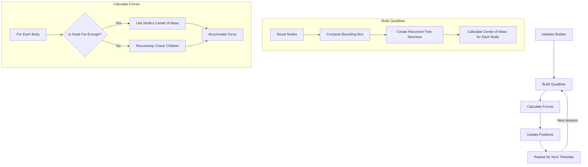

## 2. Main Program Flow

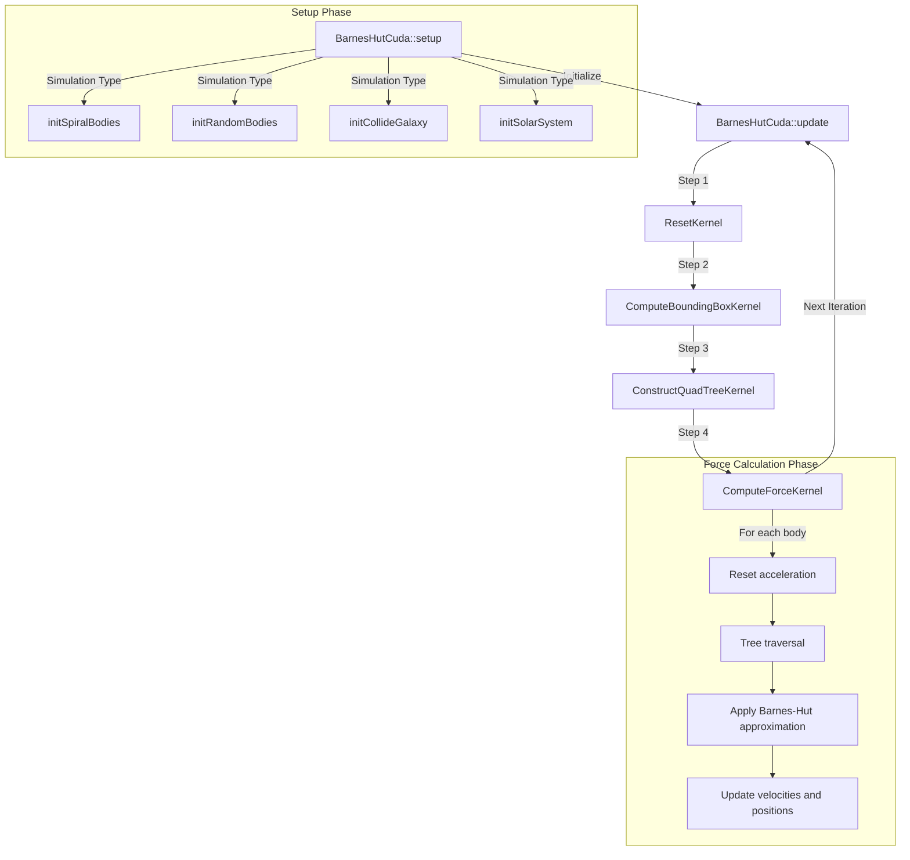

## 3. Data Structures

### Body
```cpp
typedef struct {
    bool isDynamic;      // Whether body can move
    double mass;         // Mass of body
    double radius;       // Radius of body
    Vector position;     // Position (x,y)
    Vector velocity;     // Velocity (vx,vy)
    Vector acceleration; // Acceleration (ax,ay)
} Body;
```

### Node (Quadtree Node)
```cpp
typedef struct {
    Vector topLeft;      // Top-left coordinate of region
    Vector botRight;     // Bottom-right coordinate of region
    Vector centerMass;   // Center of mass of region
    double totalMass;    // Total mass of region
    bool isLeaf;         // Whether node is a leaf
    int start;           // Start index in body array
    int end;             // End index in body array
} Node;
```

### Quadtree Structure Visualization

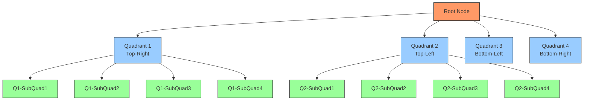

### Memory Layout

In the Barnes-Hut implementation, the quadtree is represented as a flat array of nodes where:
- The root node is at index 0
- For a node at index i, its four children are at indices 4i+1, 4i+2, 4i+3, and 4i+4
- Bodies are organized in memory to match their spatial arrangement in the quadtree

```
┌─────────────────────────────────────────────────────────────────┐
│                          Node Array                             │
├─────┬─────┬─────┬─────┬─────┬─────┬─────┬─────┬─────┬─────┬─────┤
│  0  │  1  │  2  │  3  │  4  │  5  │  6  │  7  │  8  │ ... │     │
│Root │Child│Child│Child│Child│Grand│Grand│Grand│Grand│     │     │
│     │  1  │  2  │  3  │  4  │child│child│child│child│     │     │
└─────┴─────┴─────┴─────┴─────┴─────┴─────┴─────┴─────┴─────┴─────┘

┌─────────────────────────────────────────────────────────────────┐
│                         Body Array                              │
├─────┬─────┬─────┬─────┬─────┬─────┬─────┬─────┬─────┬─────┬─────┤
│  0  │  1  │  2  │  3  │  4  │  5  │  6  │  7  │  8  │ ... │     │
│Q1   │Q1   │Q2   │Q2   │Q3   │Q3   │Q4   │Q4   │     │     │     │
│Bodies│    │Bodies│    │Bodies│    │Bodies│    │     │     │     │
└─────┴─────┴─────┴─────┴─────┴─────┴─────┴─────┴─────┴─────┴─────┘
```

## 4. Kernel Analysis

### 4.1 ResetKernel

**Purpose:** Initialize all quadtree nodes to default values before building a new tree.

**Invocation:**
```cpp
int blockSize = BLOCK_SIZE;
dim3 gridSize = ceil((float)nNodes / blockSize);
ResetKernel<<<gridSize, blockSize>>>(d_node, d_mutex, nNodes, nBodies);
```

**Inputs:**
- `Node *node`: Array of nodes representing the quadtree
- `int *mutex`: Array of mutex locks for synchronization
- `int nNodes`: Total number of nodes available in the tree
- `int nBodies`: Total number of bodies in the simulation

**Outputs:**
- `node`: Initialized with default values
- `mutex`: Initialized to 0

**Function:**
```cpp
__global__ void ResetKernel(Node *node, int *mutex, int nNodes, int nBodies) {
    int b = blockIdx.x * blockDim.x + threadIdx.x;

    if (b < nNodes) {
        // Initialize with default values
        node[b].topLeft = {INFINITY, -INFINITY};
        node[b].botRight = {-INFINITY, INFINITY};
        node[b].centerMass = {-1, -1};
        node[b].totalMass = 0.0;
        node[b].isLeaf = true;
        node[b].start = -1;
        node[b].end = -1;
        mutex[b] = 0;
    }

    // Set up root node to contain all bodies
    if (b == 0) {
        node[b].start = 0;
        node[b].end = nBodies - 1;
    }
}
```

**Parallelization:** Each thread initializes one node in the quadtree, with the first thread (b=0) performing additional work to set up the root node.

**Thread/Block Organization:**

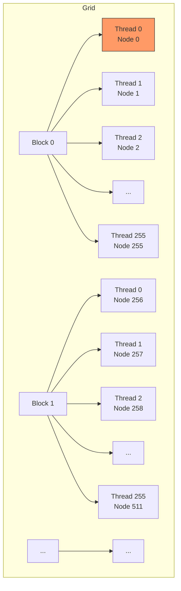

### 4.2 ComputeBoundingBoxKernel

**Purpose:** Calculate the minimum bounding box that contains all bodies in the simulation.

**Invocation:**
```cpp
int blockSize = BLOCK_SIZE;
dim3 gridSize = ceil((float)nBodies / blockSize);
ComputeBoundingBoxKernel<<<gridSize, blockSize>>>(d_node, d_b, d_mutex, nBodies);
```

**Inputs:**
- `Node *node`: Array of nodes (only root node is modified)
- `Body *bodies`: Array of all bodies in the simulation
- `int *mutex`: Array of mutex locks for synchronization
- `int nBodies`: Total number of bodies

**Outputs:**
- `node[0]`: Updated with bounding box coordinates

**Function:**
```cpp
__global__ void ComputeBoundingBoxKernel(Node *node, Body *bodies, int *mutex, int nBodies) {
    __shared__ double topLeftX[BLOCK_SIZE];
    __shared__ double topLeftY[BLOCK_SIZE];
    __shared__ double botRightX[BLOCK_SIZE];
    __shared__ double botRightY[BLOCK_SIZE];

    int tx = threadIdx.x;
    int b = blockIdx.x * blockDim.x + tx;

    // Initialize shared memory for reduction
    topLeftX[tx] = INFINITY;
    topLeftY[tx] = -INFINITY;
    botRightX[tx] = -INFINITY;
    botRightY[tx] = INFINITY;

    __syncthreads();

    // Load body positions
    if (b < nBodies) {
        Body body = bodies[b];
        topLeftX[tx] = body.position.x;
        topLeftY[tx] = body.position.y;
        botRightX[tx] = body.position.x;
        botRightY[tx] = body.position.y;
    }

    // Parallel reduction for min/max
    for (int s = blockDim.x / 2; s > 0; s >>= 1) {
        __syncthreads();
        if (tx < s) {
            topLeftX[tx] = fminf(topLeftX[tx], topLeftX[tx + s]);
            topLeftY[tx] = fmaxf(topLeftY[tx], topLeftY[tx + s]);
            botRightX[tx] = fmaxf(botRightX[tx], botRightX[tx + s]);
            botRightY[tx] = fminf(botRightY[tx], botRightY[tx + s]);
        }
    }

    // Update root node bounds with atomic operations
    if (tx == 0) {
        while (atomicCAS(mutex, 0, 1) != 0) { /* spin wait */ }
        
        // Add padding to bounding box
        node[0].topLeft.x = fminf(node[0].topLeft.x, topLeftX[0] - 1.0e10);
        node[0].topLeft.y = fmaxf(node[0].topLeft.y, topLeftY[0] + 1.0e10);
        node[0].botRight.x = fmaxf(node[0].botRight.x, botRightX[0] + 1.0e10);
        node[0].botRight.y = fminf(node[0].botRight.y, botRightY[0] - 1.0e10);
        
        atomicExch(mutex, 0);
    }
}
```

**Parallel Reduction Visualization:**

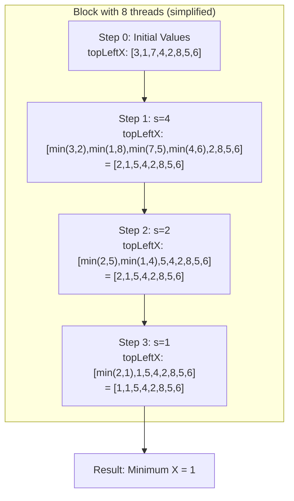

### 4.3 ConstructQuadTreeKernel

**Purpose:** Recursively build the quadtree by dividing space and grouping bodies.

**Invocation:**
```cpp
int blockSize = BLOCK_SIZE;
dim3 gridSize = ceil((float)nBodies / blockSize);
ConstructQuadTreeKernel<<<1, blockSize>>>(d_node, d_b, d_b_buffer, 0, nNodes, nBodies, leafLimit);
```

**Thread Collaboration Model for Quadtree Construction:**

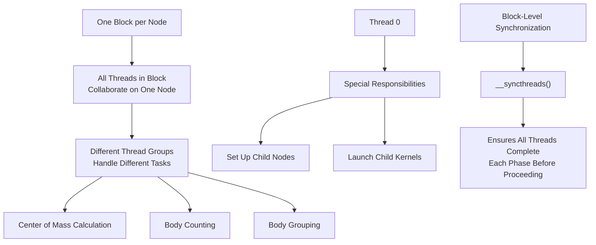

**ConstructQuadTreeKernel Parallelization Strategy:**

The `ConstructQuadTreeKernel` uses a cooperative threading model where:

1. Each node in the quadtree is processed by an entire thread block
2. Different thread groups within the block handle different subtasks
3. Thread 0 has special responsibilities for node management
4. All threads synchronize between phases with `__syncthreads()`

```cpp
__global__ void ConstructQuadTreeKernel(Node *node, Body *bodies, Body *buffer, 
                                       int nodeIndex, int nNodes, int nBodies, int leafLimit) {
    __shared__ int count[8];  // Shared memory visible to all threads in block
    int tx = threadIdx.x;     // Thread ID within the block
    
    // Each block processes a different node
    nodeIndex += blockIdx.x;
    
    if (nodeIndex >= nNodes) return;
    // ... rest of the kernel
}
```

**Overall Quadtree Construction Flow:**

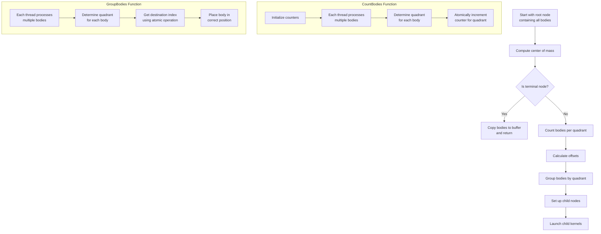

**Quadrant Numbering:**

```
┌───────┬───────┐
│       │       │
│   2   │   1   │
│Top-Left│Top-Right│
│       │       │
├───────┼───────┤
│       │       │
│   3   │   4   │
│Bottom-Left│Bottom-Right│
│       │       │
└───────┴───────┘
```

**Parallel Execution Flow for Tree Construction:**

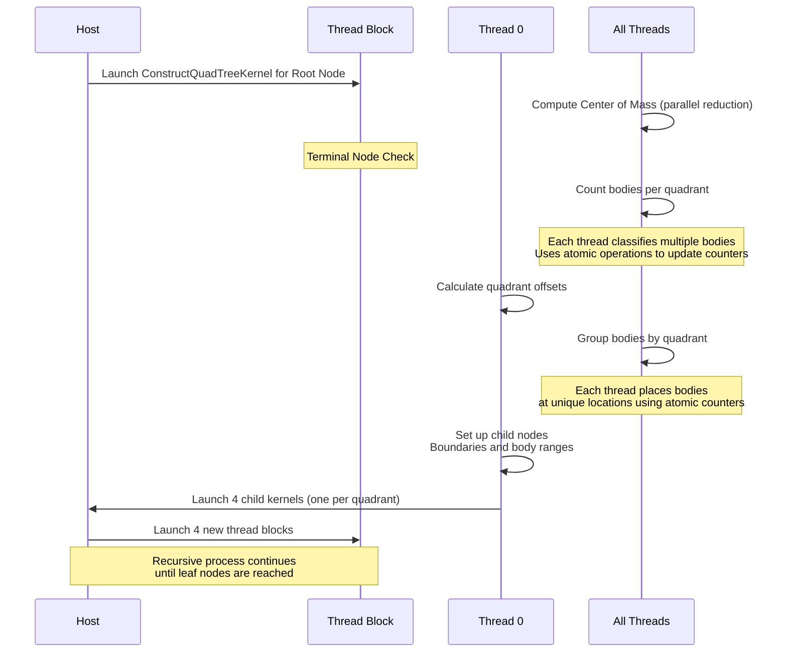

**Helper Functions in Detail:**

#### CountBodies Detailed Parallelization

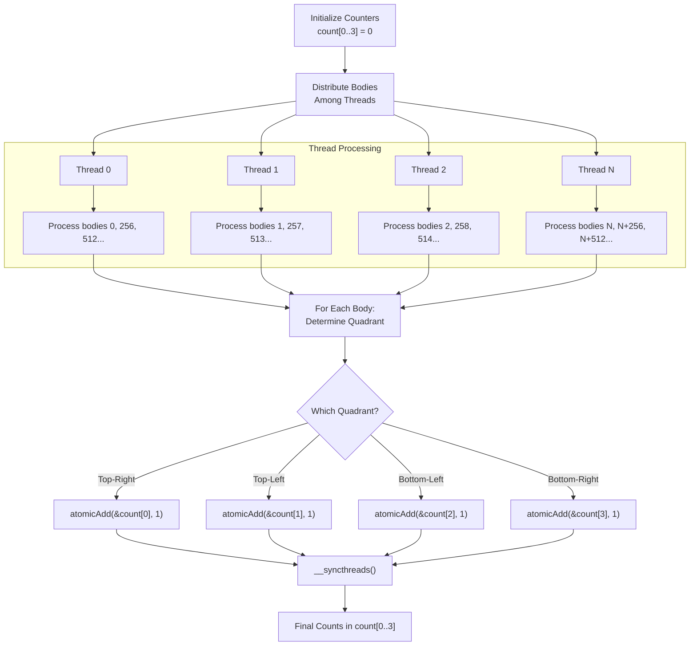

**CountBodies Code Analysis with Explanations:**

```cpp
__device__ void CountBodies(Body *bodies, Vector topLeft, Vector botRight, 
                          int *count, int start, int end, int nBodies) {
    // Calculate midpoints to divide space into quadrants
    double midX = (topLeft.x + botRight.x) / 2.0;
    double midY = (topLeft.y + botRight.y) / 2.0;
    
    int tx = threadIdx.x;
    
    // Thread 0 initializes counters
    if (tx == 0) {
        count[0] = count[1] = count[2] = count[3] = 0;
        count[4] = count[5] = count[6] = count[7] = 0; // Extra space for offsets
    }
    
    __syncthreads(); // Ensure counters are initialized before all threads proceed
    
    // Strided loop - each thread processes multiple bodies
    // Example: With 256 threads, thread 0 processes bodies 0, 256, 512...
    for (int i = start + tx; i <= end; i += blockDim.x) {
        Body body = bodies[i];
        Vector pos = body.position;
        
        // Determine which quadrant this body belongs to
        int quadrant;
        if (pos.x >= midX && pos.y >= midY)       quadrant = 0; // Top-Right
        else if (pos.x < midX && pos.y >= midY)   quadrant = 1; // Top-Left
        else if (pos.x < midX && pos.y < midY)    quadrant = 2; // Bottom-Left
        else                                      quadrant = 3; // Bottom-Right
        
        // Atomically increment counter for this quadrant
        // This prevents race conditions when multiple threads
        // try to increment the same counter simultaneously
        atomicAdd(&count[quadrant], 1);
    }
    
    __syncthreads(); // Wait for all threads to finish counting
}
```

**Key Parallelization Techniques in CountBodies:**

1. **Strided Processing**: Each thread handles bodies at regular intervals
   - With 256 threads, thread 0 processes bodies 0, 256, 512...
   - Thread 1 processes bodies 1, 257, 513...
   - This maximizes thread utilization

2. **Atomic Operations**: `atomicAdd()` prevents race conditions
   - When multiple threads try to increment the same counter
   - Ensures each body is counted exactly once per quadrant

3. **Barrier Synchronization**: `__syncthreads()` ensures all threads
   - Start with initialized counters
   - Complete counting before proceeding to the next phase

#### ComputeOffset Function

```cpp
__device__ void ComputeOffset(int *count, int start) {
    // Thread 0 calculates offsets
    if (threadIdx.x == 0) {
        // count[0..3] contains the count of bodies in each quadrant
        // Store starting offsets in count[4..7]
        count[4] = start;                       // Top-Right quadrant starts at 'start'
        count[5] = start + count[0];            // Top-Left quadrant
        count[6] = start + count[0] + count[1]; // Bottom-Left quadrant
        count[7] = start + count[0] + count[1] + count[2]; // Bottom-Right quadrant
    }
    
    __syncthreads(); // Ensure offsets are calculated before threads use them
}
```

#### GroupBodies Detailed Parallelization

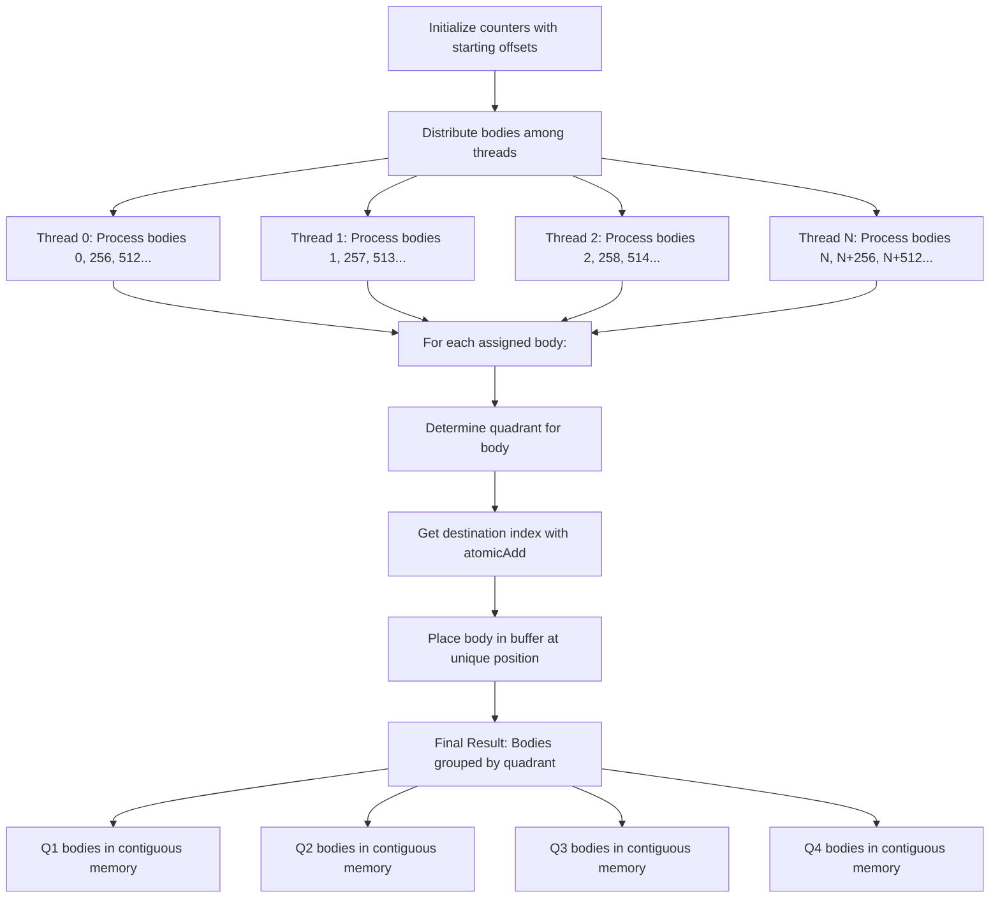

**GroupBodies Code Analysis with Explanations:**

```cpp
__device__ void GroupBodies(Body *bodies, Body *buffer, Vector topLeft, Vector botRight, 
                         int *count, int start, int end, int nBodies) {
    // Calculate midpoints to divide space into quadrants
    double midX = (topLeft.x + botRight.x) / 2.0;
    double midY = (topLeft.y + botRight.y) / 2.0;
    
    int tx = threadIdx.x;
    
    // count[4..7] now holds starting offsets for each quadrant
    // These were calculated in ComputeOffset
    
    __syncthreads(); // Ensure offsets are ready before all threads proceed
    
    // Strided loop - each thread processes multiple bodies
    for (int i = start + tx; i <= end; i += blockDim.x) {
        Body body = bodies[i];
        Vector pos = body.position;
        
        // Determine which quadrant this body belongs to
        int quadrant;
        if (pos.x >= midX && pos.y >= midY)       quadrant = 0; // Top-Right
        else if (pos.x < midX && pos.y >= midY)   quadrant = 1; // Top-Left
        else if (pos.x < midX && pos.y < midY)    quadrant = 2; // Bottom-Left
        else                                      quadrant = 3; // Bottom-Right
        
        // Atomically get destination index and increment counter
        int index = atomicAdd(&count[quadrant + 4], 1);
        
        // Place body in correct position in buffer
        buffer[index] = body;
    }
    
    __syncthreads(); // Wait for all threads to finish grouping
}
```

**Key Parallelization Techniques in GroupBodies:**

1. **Atomic Destination Indexing**: `atomicAdd()` gives each thread a unique destination
   - As threads classify bodies, they atomically increment offset counters
   - Each body gets a unique position in the output array
   - Ensures no two bodies are placed at the same location

2. **Memory Access Pattern Optimization**:
   - Bodies are reordered to match their spatial locality
   - Bodies in the same quadrant are stored contiguously
   - Improves cache coherence for later quadtree traversal
   - Reduces memory latency during force calculation

3. **Load Balancing**:
   - Strided processing ensures even distribution of work
   - Each thread processes approximately the same number of bodies

**Memory Transformation During Tree Construction:**

```
Initial Body Array (random order):
┌─────┬─────┬─────┬─────┬─────┬─────┬─────┬─────┬─────┬─────┐
│  0  │  1  │  2  │  3  │  4  │  5  │  6  │  7  │  8  │  9  │
│ Q4  │ Q1  │ Q3  │ Q1  │ Q2  │ Q4  │ Q3  │ Q2  │ Q1  │ Q2  │
└─────┴─────┴─────┴─────┴─────┴─────┴─────┴─────┴─────┴─────┘

After GroupBodies (sorted by quadrant):
┌─────┬─────┬─────┬─────┬─────┬─────┬─────┬─────┬─────┬─────┐
│  0  │  1  │  2  │  3  │  4  │  5  │  6  │  7  │  8  │  9  │
│ Q1  │ Q1  │ Q1  │ Q2  │ Q2  │ Q2  │ Q3  │ Q3  │ Q4  │ Q4  │
└─────┴─────┴─────┴─────┴─────┴─────┴─────┴─────┴─────┴─────┘
   │     │     │     │     │     │     │     │     │     │
   └─────┴─────┴─────┘     │     │     │     │     │     │
           │                │     │     │     │     │     │
        Child 1          Child 2  │  Child 3  │  Child 4  │
                              │     │     │     │     │     │
                              └─────┴─────┘     └─────┴─────┘
```

This spatial organization improves data locality, enabling more efficient memory access patterns during the tree traversal phase of the algorithm.

#### ComputeCenterMass

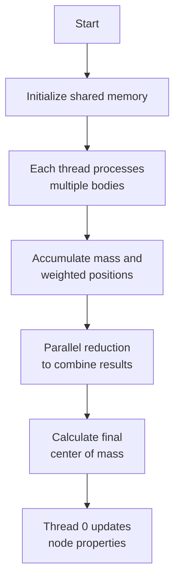

### 4.4 ComputeForceKernel

**Purpose:** Calculate gravitational forces between bodies using the quadtree for approximation, and update positions and velocities.

**Barnes-Hut Approximation Criterion Visualization:**

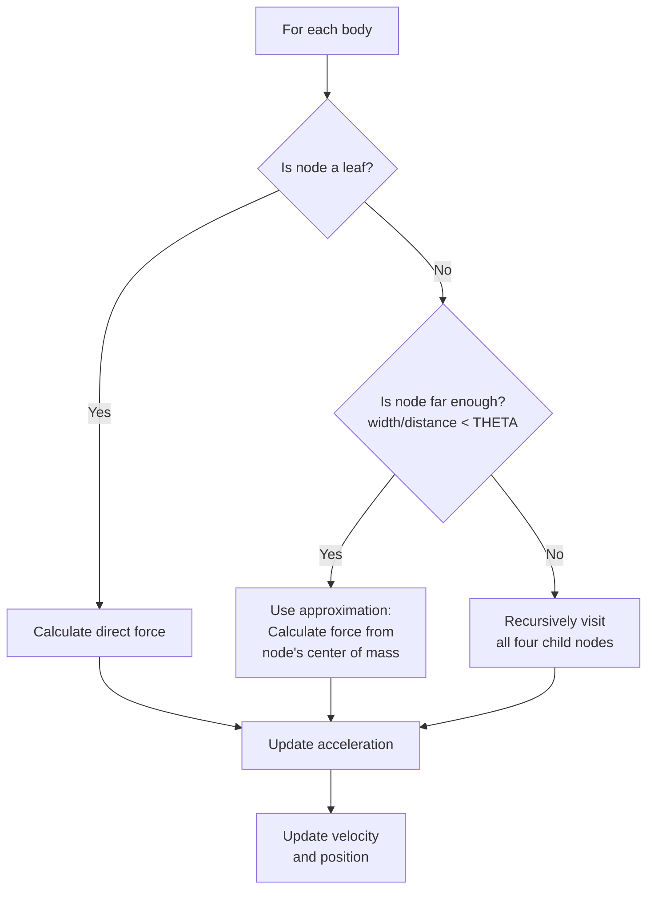

**Distance vs. Approximation:**

```
                           ┌───────────────────┐
                           │                   │
                           │                   │
                           │     Node of       │
                           │     width s       │
                           │                   │
                           │                   │
                           └───────────────────┘
                                    ↑
                                    │
                                    │ distance d
                                    │
                                    │
                                    •
                               Body position

If s/d < THETA: Use approximation (treat node as a single body)
If s/d >= THETA: Recursively check children
```

**Integration (Update Rule):**

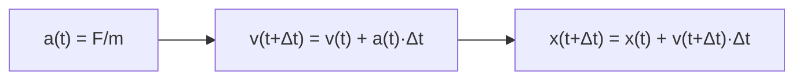

## 5. Galaxy Collision Simulation

The galaxy collision simulation creates two spiral galaxies on a collision course:

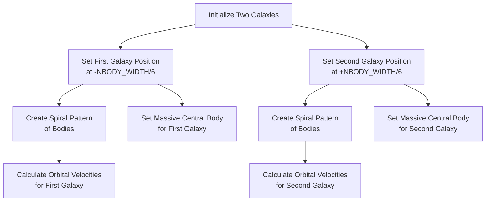

**Orbital Velocity Calculation:**

For a body at position (x,y) relative to galaxy center:
1. Calculate distance: `r = sqrt((x-centerX)² + (y-centerY)²)`
2. Create unit vector pointing from center to body: `r̂ = (x-centerX,y-centerY)/r`
3. Calculate escape velocity: `v_esc = sqrt(G*M/r)`
4. Set orbital velocity perpendicular to radius: `v = (-r̂.y, r̂.x) * v_esc`

This creates a stable spiral galaxy where bodies orbit the central mass.

## 6. Memory Management and Data Flow

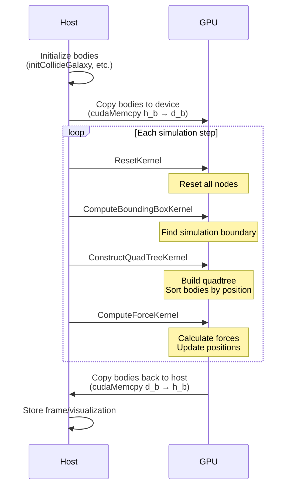

## 7. Key Algorithm Parameters and Performance Considerations

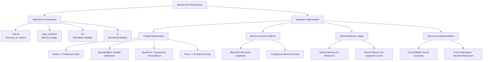

### THETA Parameter Effect on Approximation

```
Low THETA (0.1): More accurate, more traversal           High THETA (1.0): Less accurate, less traversal
┌──────┬──────┐                                          ┌──────┬──────┐
│      │      │                                          │      │      │
│ Visit│ Visit│                                          │Approx│Approx│
├──────┼──────┤                                          │      │      │
│      │      │                                          │      │      │
│ Visit│ Visit│                                          │      │      │
│      │      │                                          │      │      │
└──────┴──────┘                                          └──────┴──────┘
``` 